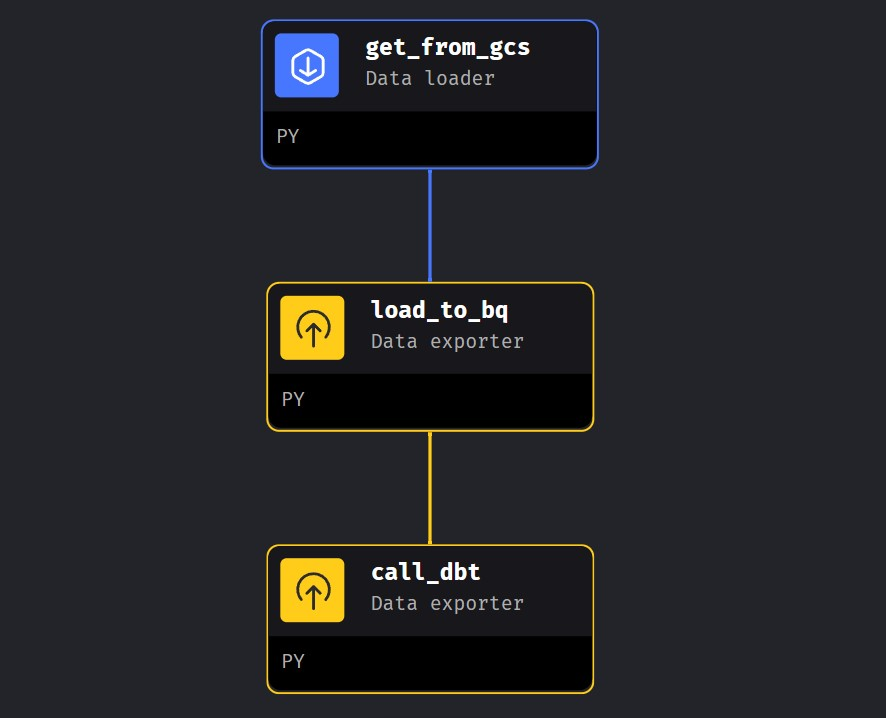

# TransparencyPortal: Enhancing Access to Public Contract Data in Portugal


### Project Description:

This project addresses the pressing need for accessible information on public contracts in Portugal. Public contracts form a crucial part of government expenditure and procurement, vital for transparency, accountability, and analysis by stakeholders like researchers, policymakers, journalists, and the public.

However, the scattered nature of information sources, differing formats, and limited accessibility pose significant challenges for accessing and analyzing public contract data. Our solution consolidates and presents this data in a structured, accessible manner.

The dataset provided on our platform includes key features such as contract ID, type, contracting authority, contractors, publication date, and contract value. Organized effectively, users can derive insights into government spending, procurement trends, contractor performance, and regulatory compliance.

Our project aims to facilitate informed decision-making, enhance transparency, and bolster accountability in public spending. By supporting research and analysis on government contracts, we aspire to contribute to better governance and public service delivery in Portugal.


### Technologies

This project utilized the following tools:

- **Mage**: Batch data/workflow orchestration tool.
- **DBT Core**: Data transformation tool for the data warehouse.
- **Terraform**: Infrastructure setup, management, and reproducibility.
- **Docker**: Hosting Prefect Agent.
- **Google Cloud Storage (GCS) Bucket**: Used as a data lake.
- **Google BigQuery**: Data warehouse.
- **Looker Studio**: Reporting and visualization.

### Project Workflow


The project workflow involved the following steps:

1. **Creating Pipelines**:
   - **Pipeline 1 - url_to_gcs**:
     1. Get data from URLs.
     2. Clean the data.
        - 2.1 Convert columns to the correct data types.
        - 2.2 Rename columns to English.
        - 2.3 Handle contracts spanning multiple cities, with multiple cities listed in a single row for a contract ID.
     3. Send data to Google Cloud Storage.

    
   - **Pipeline 2 - gcs_to_bq**:
     1. Retrieve data from Google Cloud Storage.
     2. Send the data to BigQuery.
     3. Trigger the dbt_run pipeline.

    
   - **Pipeline 3 - dbt_run**:
     1. Data type treatment.
     2. Handle the contract type column, which has the same issue as the cities, i.e., multiple contract types for a single contract ID.
     3. Trim columns that need it.
     4. Create a partitioned and clustered fact table.

     

### Terraform Usage

Terraform was utilized to provision the necessary resources on Google Cloud Platform (GCP). After setup, MageAI was used for easy setup and orchestration of all pipelines.

# Terraform Configuration for Google Cloud Platform

This Terraform configuration provisions resources on Google Cloud Platform (GCP), including Google Cloud Storage buckets and BigQuery datasets.

## Prerequisites

1. **Google Cloud Platform (GCP) Account**: You need to have a GCP account.
2. **Service Account**: Create a service account and download the JSON key file. Ensure that this service account has the necessary permissions to create resources like Google Cloud Storage buckets and BigQuery datasets.
3. **Terraform Installed**: Make sure you have Terraform installed on your machine. You can download it from [Terraform's official website](https://www.terraform.io/downloads.html).

## Dashboard Explanation

If you wish to access the final dashboard, you can find the link [here](https://lookerstudio.google.com/reporting/33c3a880-4602-4cf2-842f-4312d7dbfc56).
If for any reason you are unable to access the dashboard, GitHub includes a PDF named "Transparency_Portal_Portugal" containing the dashboard.
The dashboard comprises two primary charts aimed at providing insights into public contract expenditure:

1. **Contract Expenditure by Type:**
   - **Goal:** This chart showcases the types of contracts that have incurred the highest expenditure in Portugal, offering a comprehensive overview of spending distribution across various contract categories.
   - **Objective:** To provide stakeholders with a clear understanding of where public funds are allocated across different types of contracts, fostering transparency in government spending.

2. **Expenditure by District:**
   - **Goal:** This chart offers a detailed breakdown of expenditure by district, enabling users to discern regional spending patterns and trends.
   - **Objective:** To empower users to analyze regional variations in public contract expenditure, facilitating informed decision-making and accountability at the local level.

Additionally, the dashboard features interactive filters, allowing users to explore data based on contract type, district, or city, thereby enhancing the flexibility and usability of the platform.

## Reproducibility Steps


### 1. Clone the Repository and Navigate to the Terraform Directory

Clone the repository containing the Terraform configuration and navigate to the Terraform directory:

```
git clone https://github.com/Edum4d/TransparencyPortal-Enhancing-Access-to-Public-Contract-Data-in-Portugal.git
```
### 2. Place Your GCP Credentials File

Before proceeding, ensure you place your Google Cloud Platform (GCP) service account credentials file within a directory of the project. For example, create a directory named `keys` within the `terraform` directory and place your credentials file there. 

Example directory structure:
```
terraform/
├── secret/
│ └── go-de-zoomcamp-project-2024.json
├── main.tf
├── variables.tf
└── ...
```

Ensure the credentials file is named appropriately and matches the path specified in the Terraform configuration.


### 3. Update Variable Defaults

Navigate to the `variables.tf` file and update the default values of the following variables to match your setup:

- `project` - my default: `transparencyportal-420117`
- `region`- my default: `us-central1`
- `location` - my default: `US`
- `bq_dataset_name` - my default: `transparencyportal_bq`
- `gcs_bucket_name` - my default: `transparencyportal_bucket`
- `credentials`: Update this variable with the path to your Google Cloud service account credentials JSON file. For example, if you placed your credentials file in a directory named keys within the terraform directory, the path would be `./secret/go-de-zoomcamp-project-2024.json`.

### 4. Modify Configuration

In the `main.tf` file, ensure consistency between the values of `bq_dataset_name` in the `google_bigquery_dataset` resource and `gcs_bucket_name` in the `google_storage_bucket` resource with the corresponding variables defined in the `variables.tf` file.


### 5. Initialize Terraform

- Open a terminal or command prompt.
- Navigate to the directory containing your `main.tf` file.
- Run the following command to initialize Terraform and download the necessary provider plugins:

  ```
  terraform init
  ```

### 6. Initialize Terraform Review Plan
After initialization, run the following command to see what Terraform plans to do:
```
terraform plan
```
Review the plan to ensure it will create the resources as expected and without errors.

### 7. Apply Changes
Once you're satisfied with the plan, apply the changes by running:
```
terraform apply
```
Terraform will prompt you to confirm the changes. Type yes and press Enter to proceed.

After executing the commands, navigate to your Google Cloud Platform (GCP) Console and verify if the Google Cloud Storage (GCS) bucket and BigQuery (BQ) dataset have been successfully created.

### 8. Create .env File

Navigate to the  project root directory and then to the `mage` directory with the name `mage_transparencyportal`:

```
cd ..
cd mage_transparencyportal
```
Copy the dev.env file to create a new file named .env. This new file will contain the necessary variables for the project to run:

```
cp dev.env .env
```

After copying, open the .env file and update the GCP credentials to match the credentials set up in `terraform/variables.tf`. Ensure that the credentials match to avoid any authentication issues during project execution.
Update the following variables:

- `STORAGE_BUCKET_NAME`: Change to `gcs_bucket_name` to match the Terraform variable.
- `BIGQUERY_DATASET_NAME`: Change to `bq_dataset_name` to match the Terraform variable.
- `GCLOUD_PROJECT_NAME`: Change to `project` to match the Terraform variable.


Ensure that the credentials match to avoid any authentication issues during project execution.


### 9. Place Your GCP Credentials File

Additionally, place your Google Cloud Platform (GCP) credentials file in the `secrets` folder within the `mage_transparencyportal` directory:

```
mage_transparencyportal/
└── secrets/
    └── go-de-zoomcamp-project-2024.json
```
Ensure that the credentials file is named appropriately and matches the path specified in your application for authentication.

Update the following variables in your `.env` file:

- `GOOGLE_APPLICATION_CREDENTIALS`: Update this variable with the relative path to your service account credentials JSON file inside `mageai`. For example: `home/src/secrets/go-de-zoomcamp-project-2024.json`.

- `SERVICE_ACCOUNT_KEY_FILEPATH`: Update this variable with the relative path to your service account credentials JSON file within the project directory. For example: `secrets/go-de-zoomcamp-project-2024.json`.

### 10. Running MageAI Docker Container

    Follow these steps to run the `mageai` Docker container:

    1. **Ensure Docker is Installed**: Make sure Docker is installed on your machine.

    2. **Run Docker Compose**: Open a terminal or command prompt, navigate to your project directory, and execute `docker-compose up -d`. This command starts the Docker containers defined in the `docker-compose.yml` file in detached mode.

    3. **Access the Container**: Once the containers are running, access the `mageai` service at `http://localhost:6789` in your web browser.

    That's it! You've successfully launched the `mageai` Docker container. Adjust the configuration and environment variables as needed for your specific setup.

### Step 10: Run Pipeline

To execute the entire pipeline, follow these steps:

1. Open your terminal or command prompt.

2. Enter the following command:

    ```
    mageai pipeline "url_to_gcs"
    ```

    Replace `"url_to_gcs"` with the actual URL to your Google Cloud Storage (GCS) where your pipeline configuration resides.

3. Press Enter to execute the command.

    #### Automated Trigger

    A pipeline trigger is set to run automatically every Friday. 

### Step 11: If you want to delete Cloud Resources (Optional)
If you want to delete the resources created by Terraform, you can run:
```
terraform destroy
```
Again, confirm the destruction by typing yes when prompted.

